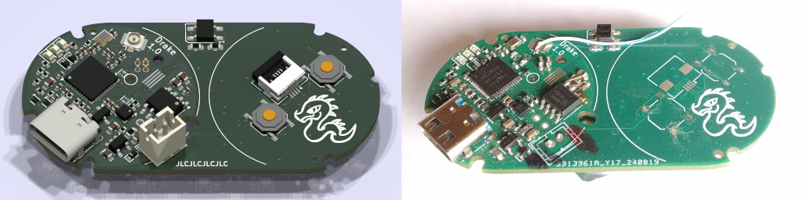

# Drake

The Drake hardware is a multi-purpose PCB which can be used to build a wireless dropper post actuator or a rear light.

## Actuator features

- Bluetooth connectivity for remote control and configuration.
- I2C connectivity for control, configuration and sensor readings.
- motor sensor to minimize current consumption with timeout fallback
- construction files for Fox Transfer dropper posts available

## Light features

- two configurations with either 16 or 44 WS2812 LEDs
- 8 configurable modes
- configurable LED pattern
- ability to control a dropper actuator over a FFC (using I2C)

## License

This project is licensed under the BSD-2-clause License - see the [license.txt](license.txt) file for details
